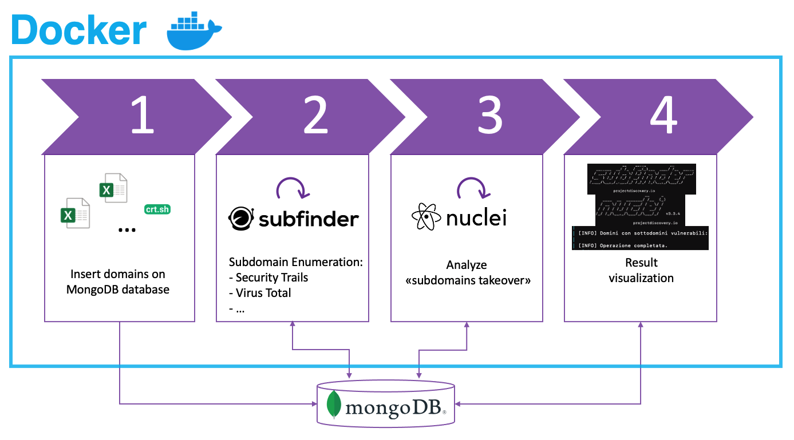

# Subdomain Takeover App

Tool per la ricerca di sottodomini con vulnerabilità al "subdomain takeover". A partire da uno o più domini (es. example.com), il tool effettua l'enumerazione dei sottodomini e la successiva scansione di essi per verificare la possibile vulnerabilità, utilizzando un database MongoDB per lo storage dei risultati. Se già presenti dei domini nel DB, verranno scansionati nuovamente se l'enumerazione dei sottodomini è avvenuta più di un mese prima.

## Configurazione e Avvio

L'applicazione è completamente containerizzata, il che significa che è possibile eseguirla con Docker. Di seguito i requisiti e le istruzioni per configurare e avviare il progetto.

### Requisiti
- Docker
- Docker Desktop

### Configurazione e avvio 
1. Clonare il repository nell'ambiente locale:

```bash
git clone https://github.com/matteo-coni/subdomain_takeover.git
cd subdomain_takeover
```

2. Configurare le variabili d'ambiente per MongoDB:
Per poter utilizzare il tool, è necessario avere un account Atlas MongoDB e creare (gratuitamente) un database vuoto. Successivamente, è necessario aggiungere "Username" e "Password" (dell' account Atlas MongoDB) e "MONGO_URI", "DATABASE_NAME" e "COLLECTION_NAME" (del database creato) nel file **docker-compose.yml**. Più precisamente:
- Row 10: username
- Row 11: password
- Row 22: MONGO_URI (da sezione "Connect" MongoDB)
- Row 23: DATABASE_NAME 
- Row 24: COLLECTION_NAME

3. Inserire domini da analizzare nel file domains.txt:
- Un solo dominio
```bash 
cd data
echo "example.com" >> domains.txt
```
- Più domini
```bash 
cd data
echo "example.com\nbar.com\nfoo.com" >> domains.txt
```
- Se si possiede già una lista di domini (uno per ogni riga):
```bash 
cat altro_file.txt >> domains.txt
```
- E' possibile anche utilizzare un editor di testo (es vim/nano) e modificare il file.

4. Eseguire il comando per avviare il container dell'applicazione e il database MongoDB:

```bash
docker-compose up --build
```
In questo modo verrà configurato il container e eseguito il tool in esso presente.

### Stop e pulizia
Per fermare i container in esecuzione:
```bash
docker-compose down
```

Per rimuovere i container:
```bash
docker-compose down -v
```

## Architettura e Toolchain
1. Inserimento domini da analizzare nel database personale MongoDB
2. Recupero sotto domini attraverso il tool Subfinder (https://github.com/projectdiscovery/subfinder)
3. Analisi vulnerabilità "subdomains takeover" tramite il tool Nuclei (https://github.com/projectdiscovery/nuclei)
4. Salvataggio informazioni su database MongoDB e visualizzazione su terminale




## Ulteriore Configurazione 
### Subfinder
Subfinder, utilizzato per il recupero dei sottodomini, utilizza di base dei dataset gratuiti, tra cui crtsh per la Certificate Transparency. E' possibile aggiungere API di alcuni servizi aggiuntivi per rendere la ricerca più completa ed efficente nel file **provider-config.yaml**. 

### Nuclei
Nuclei, utilizzato come già detto per rilevare sottodomini vulnerabili al "subdomains takeover", utilizza i template presenti in "nuclei-templates/http/takeovers" e i template "dns/azure-takeover-detection.yaml" e "dns/elasticbeanstalk-takeover.yaml: è possibile personalizzarli e/o aggiungerne di nuovi.

### MongoDB
E' possibile anche scansionare dei documenti già presenti in un database MongoDB. Essi devono avere la seguente forma:
```json
{"_id":{"$oid":"6745e7edd95e48b221a8bee6"},
"domain":"example.com",
"retrieve_date":{"$date":{"$numberLong":"1732637155355"}},
"subdomains":[{"name":"www.example.com","vulnerable":false,"last_vulnerability_check":{"$date":{"$numberLong":"1732637167129"}}}]}
```


